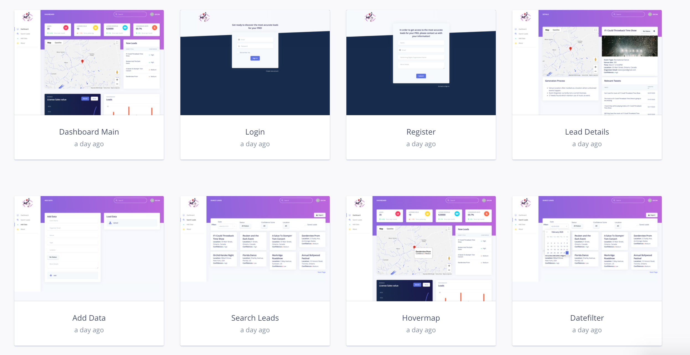

# UX Research
 
## Plan & Process
In order to conduct UX research studies for our application we had to find individuals who were involved in sales or finance as we are creating a lead generation application. The two individuals we studied were:

1. Tax Supervisor - age ~25
2. Digital Marketing Agent - age ~45

We believed that these users represented a good spectrum of knowledge inside the industry of sales. User 1 (Tax Supervisor) also has legal expertise, which gave them more insight into copyright and privacy issues. As well, there is age diversity, as we want to see how users of different ages interact with our software. Another note is that User 2’s (Digital Marketing Agent) first language is not English, so we are looking upon studying how language diversity affects the user experience of our application as well.
 
We also introduced our users on what the application was about, which was finding potential leads for music licenses based on events through data analytics. Then we devised tasks for our users to attempt:
1. Creating an account and logging in
2. Viewing detailed event information
3. Setting/Changing Status for an event lead
4. Saving an event lead and viewing all saved event leads
5. Filtering event leads by various categories on search page
6. Export event lead data
7. Manually add event lead data
8. View and edit profile information
 
As they completed each of these tasks, we would ask them for their opinions on each of the screens and functions. We also asked them to think out loud as much as they were comfortable with as they were completing the tasks, so we could accurately assess how they felt. We created mockups to allow our users to complete these tasks. This was done with the help of InVision (view our mockups on our public InVisionApp url here: https://invis.io/RJW5IIOC2T6).

 
## Findings
These user studies provided us with very useful data to help improve our UI/UX design. On the positives: overall, they found the application user-friendly and easy to use. They also found many aspects of our application useful, for example they liked the data metrics they saw  on the dashboard after logging in. While they were confused what conversion rate meant at first, after explaining it to them (that it showed which leads from our application actually led to a successful sale) they thought it was an important metric. User 1 thought it was useful that they could change the status of leads in order to keep track of them. This user was also found the confidence score potentially beneficial (found on the lead detail page), as it would help them contact the most prospective successful leads. 
 
We found that there were a few tasks difficult for our users, and this mainly dealt with the naming conventions or the style and placement of a component. For both users, it was not exactly clear on how to create an account or go back to the sign in page. It is clear to us where we can improve, as they both found it too small in text size. Other tasks may have been difficult for one user and obvious to the other. For example, User 2 had difficulty finding out how to save a lead, this is because we only had a star icon for each lead, which for them it was not obvious that “star” meant “save.” While User 1 was able to easily complete this task, they also felt that “save” was not appropriate for a star icon. Also, User 2 had difficulty finding how to go to their user profile, as it was located in the corner in the top right and did not say “Profile.” This may show for users’ whose first language is not English, they may want more indicators in order to find certain pages. However, despite language, our icons and text must still convey our message intuitively, as both users struggled with different aspects of the application. From these results, it shows us where we need to make our application more easy to use.
 
Both users also had suggestions on where we can improve our application in order to make it more useful for discovering leads. For example, both felt that there should be more information on what sort of license that they should actually try to sell to a potential lead and the revenue calculation from that. As well, User 1 pointed out the need for robust error-checking to prevent an occurence of duplicate/inaccurate data being added manually by the app user on the "Add Data" page. They also wanted more fine grained location filters, because there could be licensing managers per city and not just country. Finally, they had another suggestion which was that they felt that revealing the organizer email for contact may be too sensitive, which we’ll need to take into consideration as well. We have recognized the importance of the feedback and suggestions both users provided, giving us solid ideas to both improve existing functionality and introduce new potentially useful features to incorporate into our roadmap.
 
More research will certainly be required as we continue to update our UI and make changes to our app's functionality, in order to best meet our users' diverse demands.
 
## Appendix Notes
 
### User 1
 
**Tax Supervisor with experience in sales, marketing and legal issues**
 
**Task 1 - Creating an account and logging in**
 
This user found the navigation buttons between the login and registration screens unclear, as they were unable to notice the "Create new account" or "Go back to Sign In" buttons at first. They said these buttons should be made more clear and obvious.
 
Additional Comments:
 
- upon logging in, stated that there was too much information being presented on dashboard, looked cluttered
- suggested new lead information be shown on a separate page from all of the data analytics charts/graphs
- however, they generally liked the metrics and graphs, and while they did not know what conversion rate meant at first, after explaining they definitely found it useful
 
**Task 2 - Viewing detailed event lead information**
 
This user found it easy to get to the detailed information page for an event lead in the intended manner, by clicking on the event title from the lead listings on the dashboard.
 
Additional Comments:
 
- expressed potential privacy concern to consider regarding event organizer email being displayed openly on event details page, perhaps we should provide another way to contact event organizer, or contact information shown should be limited to what is publicly available
- felt that showing lead discovery background support/evidence (e.g. relevant tweets to an event lead) might not be important or relevant to licencing reps
- unclear on details page whether any of the leads shown are already licenced or not, suggested our app may filter them out automatically using PRO data, or automatically mark their status upon discovery to indicate that they have a licence
- confused on what confidence score meant at first, after explaining it showed how successful a lead could lead to a sale, felt that this would be very beneficial 
 
**Task 3 - Setting/changing status for an event lead**
 
This user found it easy to set/change status for an event lead from its details page in the intended manner, by clicking on the status button.
 
Additional Comments:
- acknowledged that status updates are very useful to help them track the contact status of a lead
- stated that we should confirm which specific status options PRO's would desire the ability to set for event leads (e.g. contacted, successful, discarded)
- felt that status change history should be viewable, as well as contact history with the event organizer (e.g. email communications) if possible
 
**Task 4 - Saving an event lead and viewing all saved event leads**
 
This user found it easy to save an event lead from its details page in the intended manner, by clicking on the save icon. However, they then found it difficult to find where to view all of their saved event leads. They initially went to the dashboard to see if their saved leads had appeared there, before going to the search page. Once on the search page however, they found it easy to view only their saved events in the intended manner, by clicking on the checkbox option.
 
Additional Comments:
 
- felt that "Search Leads" option in side menu was misleading, as it seemed to indicate some sort of basic search functionality, not the place to view all available event leads (as it currently is), menu option icon and name should be modified to better reflect true functionality, suggested "Lead Data" or "Lead Database" as alternative names
 
**Task 5 - Filtering event leads by various categories on search page**
 
This user found it easy to filter event leads in the intended manner, by clicking on the appropriate filter category buttons.
 
Additional Comments:
 
- found location filtering (currently a dropdown showing just country options) to not be granular enough, felt that options by province/state/city would be much more useful
- felt that save icon looked like a favourite icon given its star shape, should either change icon or rename "Saved" to "Favourites"
 
**Task 6 - Export event lead data**
 
This user found it easy to export all event lead data from the search page in the intended manner, by clicking on the export button, but commented that export file type options other than the Excel default should be available.
 
**Task 7 - Manually add event lead data**
 
This user found it easy to access the "Add Data" page and to insert event leads manually in the intended manner in both ways, either by filling out the provided form or by uploading a data file. 
 
Additional Comments:
 
- expressed concern regarding the possibility of a user adding duplicate or inaccurate data
- suggested form be more detailed, to allow adding full event address information rather than just the current text box for a "Location" input
 
**Task 8 - View and edit profile information**
 
This user found it easy to view and edit profile information in the intended manner, by clicking on their profile icon in the top-right corner and selecting "My profile."
 
**Closing Comments and Feedback**
 
- showing potential revenue predictions for event leads could be useful, rather than having users manually input revenue received from successful leads for data analytics
- map and list views on dashboard should have filter options to show either all or just new event leads
- default set of leads shown on search page should be only those with relevant status to indicate they have not yet been addressed (i.e. hide discarded and successful leads by default), as those are of highest priority
- sleek look, fairly intuitive and easy to use overall
- found metrics displayed on dashboard useful
- good features and functionality to accomplish various desired tasks
- expanding functionality to manually upload existing licence data and manage current licences may be useful
 
### User 2
 
**Digital Marketing Agent with experience in sales and lead targeting**
 
**Task 1 - Creating an account and logging in**
 
This user found the navigation buttons between the login and registration screens unclear, as they were unable to notice the "Go back to Sign In" button at first.
 
Additional Comments:
 
- upon logging in, had questions about what each metric meant at the top, after explaining it to them they found conversion rate would be useful for them
 
**Task 2 - Viewing detailed event lead information**
 
This user found it easy to get to the detailed information page for an event lead in the intended manner, by clicking on the event title from the lead listings on the dashboard.
 
**Task 3 - Setting/changing status for an event lead**
 
This user found it easy to set/change status for an event lead from its details page in the intended manner, by clicking on the status button.
 
**Task 4 - Saving an event lead and viewing all saved event leads**
 
This user found it unclear how to save an event lead from its details page in the intended manner, as they didn't notice the save icon at first. They suggested that the icon should be larger and more obvious. They also found it difficult to find where to view all of their saved event leads. They correctly navigated to the search page, but initially tried applying a status filter, before noticing the checkbox item on the far-right to select to only show saved leads.
 
**Task 5 - Filtering event leads by various categories on search page**
 
This user found it easy to filter events in the intended manner, by clicking on the appropriate filter category buttons.
 
**Task 6 - Export event lead data**
 
This user found it easy to export all event lead data from the search page in the intended manner, by clicking on the export button.
 
**Task 7 - Manually add event lead data**
 
This user found it easy to access the "Add Data" page to insert event leads manually in the intended manner, both by filling out the provided form or by uploading a data file.
 
**Task 8 - View and edit profile information**
 
This user found it unclear how to view and edit profile information. They didn't attempt clicking their profile icon in the top-right corner at first, and initially tried looking for a Profile menu option instead.
 
**Closing Comments and Feedback**
 
- felt that it would potentially be beneficial to display more specific event lead details, in order to suggest the type of licence our users (licencing reps) can contact the event organizer about acquiring
- found app to be fairly user-friendly and good-looking overall, and found the highlighted data metrics on the dashboard useful
 
